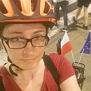

# Anna Ochab-Marcinek, Ph. D. (dr hab.)

[Dioscuri Centre for Physics and Chemistry of Bacteria](https://ichf.edu.pl/groups/dioscuri-centre-for-physics-and-chemistry-of-bacteria), [Institute of Physical Chemistry, Polish Academy of Sciences](http://www.ichf.edu.pl/), Warsaw, Poland

[Google Scholar]([https://](https://scholar.google.pl/citations?hl=en&user=9NTn4X8AAAAJ&view_op=list_works&sortby=pubdate)) - [ORCID]([https://](https://orcid.org/0000-0002-2462-0656)) - [ResearcherID]([https://](https://www.webofscience.com/wos/author/record/D-8322-2017))

[CV](#cv) - [Research](#research) - [Publications](#publications) - [COVID-19](#covid-19-advisory-team-to-the-president-of-the-polish-academy-of-sciences) - [GitHub](#github) - [Patents](#patents) - [Grants](#grants) - [Popular science](#popular-science) - [Tablet for a person with a mobility impairment (PL)](https://anuszka.github.io/tablet-dla-niepelnosprawnego/) - [**Contact**](#contact)

## CV

[CV (pdf)](./Anna_Ochab-Marcinek_CV_short.pdf)

## Research

* Software development for automated recognition of bacteria in microscopic images
* Modeling of biological evolution
* Stochastic gene expression
* Diffusion in a crowded environment

## Publications

1. J. Jędrak, M. Rubin, A. Ochab-Marcinek, [Generalization of Powell's results to population out of steady state](https://journals.aps.org/pre/abstract/10.1103/PhysRevE.108.024405), Physical Review E 108 (2), 024405 (2023) \[arxiv [preprint](https://arxiv.org/abs/2208.05884)\]
2. J. Jędrak, A. Ochab-Marcinek, [Contributions to the 'noise floor' in gene expression in a population of dividing cells](https://www.nature.com/articles/s41598-020-69217-2), Scientific Reports, 10, 13533 (2020)
3. J. Jędrak, M. Kwiatkowski, A. Ochab-Marcinek , [Exactly solvable model of gene expression in proliferating bacterial cell population with stochastic protein bursts and protein partitioning](https://link.aps.org/doi/10.1103/PhysRevE.99.042416), Phys. Rev. E, 99 (2019) 042416 \[arxiv [preprint](https://arxiv.org/abs/1904.08216v1)\]
4. A. Ochab-Marcinek, J. Jędrak, M. Tabaka, [Hill kinetics as a noise filter: The role of transcription factor autoregulation in gene cascades](http://pubs.rsc.org/en/content/articlehtml/2017/cp/c7cp00743d), Phys. Chem. Chem. Phys., 2017, 19, 22580-22591
5. G. Angulo, J. Jędrak, A. Ochab-Marcinek, P. Pasitsuparoad, C. Radzewicz, P. Wnuk, A. Rosspeintner, [How good is the generalized Langevin equation to describe the dynamics of photo-induced electron transfer in fluid solution?](http://aip.scitation.org/doi/full/10.1063/1.4990044) , J. Chem. Phys. 146 (2017) 244505 \[arxiv [preprint](https://arxiv.org/abs/1704.06066)\]
6. J. Jędrak, A. Ochab-Marcinek, [Influence of gene copy number on self-regulated gene expression](http://www.sciencedirect.com/science/article/pii/S0022519316302521), J. Theor. Biol., 408 (2016) 222 \[arxiv [preprint](http://arxiv.org/abs/1608.04541)\]
7. J. Jędrak, A. Ochab-Marcinek, [Time-dependent solutions for a stochastic model of gene expression with molecule production in the form of a compound Poisson process](http://journals.aps.org/pre/abstract/10.1103/PhysRevE.94.032401), Phys. Rev. E 94 (3) (2016) 032401 \[arxiv [preprint](http://arxiv.org/abs/1608.07139)\]
8. T. Kalwarczyk, K. Sozanski, A. Ochab-Marcinek, J. Szymanski, M. Tabaka, S. Hou, R. Hołyst, [Motion of nanoprobes in complex liquids within the framework of the length-scale dependent viscosity model](http://www.sciencedirect.com/science/article/pii/S0001868615000925#), 2015, Advances in Colloid and Interface Science, 2015, 223, 55-63.
9. A. Ochab-Marcinek, M. Tabaka, [Transcriptional leakage versus noise: A simple mechanism of conversion between binary and graded response in autoregulated genes](http://journals.aps.org/pre/abstract/10.1103/PhysRevE.91.012704), Phys. Rev. E, 2015, 91(1), 012704 \[arxiv [preprint](http://arxiv.org/pdf/1412.5982)\]
10. K. Sozanski, A. Wisniewska, T. Piasecki, K. Waszczuk, A. Ochab-Marcinek, T. Gotszalk,R. Hołyst, [Depletion Layer in Polymer Solutions at an Interface Oscillating at the Subnano-to Submicrometer Scale](http://pubs.rsc.org/en/Content/ArticleLanding/2014/SM/C4SM01280A), Soft Matter 2014, 10, 7762-7768  
    \[ [free accepted manuscript](2014.sozanski.soft_matter.pdf) - please note that according to the RSC license, this pdf copy may not be further made available or distributed\]
11. T.K.Piskorz, A. Ochab-Marcinek, [A Universal Model of Restricted Diffusion for Fluorescence Correlation Spectroscopy](http://pubs.acs.org/doi/abs/10.1021/jp502467u), J. Phys. Chem. B, 2014, 118 (18), 4906–4912
12. A. Lewandrowska, A. Majcher, A. Ochab-Marcinek, M. Tabaka, R. Hołyst, [Taylor Dispersion Analysis in Coiled Capillaries at High Flow Rates](http://pubs.acs.org/doi/abs/10.1021/ac4007792), Anal. Chem., 2013, 85 (8), 4051–4056
13. A. Ochab-Marcinek, S.A. Wieczorek, N. Ziębacz, R. Hołyst, [The effect of depletion layer on diffusion of nanoparticles in solutions of flexible and polydisperse polymers](2012.ochab.soft_matter.pdf) , Soft Matter 2012, 8, 11173-11179  
    \[please note that according to the RSC license, this pdf copy may not be further made available or distributed\]
14. A. Ochab-Marcinek, R. Hołyst, [Scale-dependent diffusion of spheres in solutions of flexible and rigid polymers: mean square displacement and autocorrelation function for FCS and DLS measurements](2011.ochab.soft_matter.pdf) , Soft Matter 2011, 7, 7366-7374  
    \[please note that according to the RSC license, this pdf copy may not be further made available or distributed\]
15. A. Ochab-Marcinek, M. Tabaka, [Bimodal gene expression in noncooperative regulatory systems](http://www.pnas.org/content/107/51/22096) , PNAS 107(51) (2010) 22096-22101
16. A. Ochab-Marcinek, [Extrinsic noise passing through a Michaelis-Menten reaction: A universal response of a genetic switch](http://dx.doi.org/10.1016/j.jtbi.2009.12.028), J. Theor. Biol. 263(4) (2010) 510-520 \[arxiv [preprint](http://arxiv.org/pdf/0905.3502v2)\]
17. A. Ochab-Marcinek, E. Gudowska-Nowak, E. Nasonova, S. Ritter, [Modelling radiation-induced cell cycle delays](http://www.springerlink.com/content/l33041651m10815w/fulltext.pdf), Rad. Env. Biophys. 48(4) (2009) 361 \[arxiv [preprint](http://arxiv.org/pdf/0907.3840), the original publication is available at <www.springerlink.com\>]
18. A. Ochab-Marcinek, G. Schmid, I. Goychuk, P. Hanggi, [Noise-assisted spike propagation in myelinated neurons](http://journals.aps.org/pre/abstract/10.1103/PhysRevE.79.011904), Phys. Rev. E 79, 011904 (2009) \[arxiv [preprint](http://arxiv.org/pdf/0811.3371)\]
19. A. Fiasconaro, A. Ochab-Marcinek, B. Spagnolo, E. Gudowska-Nowak, [Monitoring noise-resonant effects in cancer growth influenced by external fluctuations and periodic treatment](http://link.springer.com/article/10.1140/epjb/e2008-00246-2), Eur. Phys. J. B 65, 435-442 (2008) \[arxiv [preprint](http://arxiv.org/pdf/0710.1317)\]
20. Anna Ochab-Marcinek, [Predicting the asymmetric response of a genetic switch to noise](http://dx.doi.org/10.1016/j.jtbi.2008.04.032), J. Theor. Biol. 254 (2008) 37-44 \[arxiv [preprint](http://arxiv.org/pdf/0804.4218)\]
21. B. Spagnolo, A.A. Dubkov, A.L. Pankratov, E.V. Pankratova, A. Fiasconaro, A. Ochab-Marcinek [Lifetime of Metastable States and Suppression of Noise in Interdisciplinary Physical Models.](http://www.actaphys.uj.edu.pl/fulltext?series=Reg&vol=38&page=1925) Acta Physica Polonica B 38(5) 2007, 1925.
22. Anna Ochab-Marcinek, Alessandro Fiasconaro, Ewa Gudowska-Nowak, Bernardo Spagnolo, [Coexistence of resonant activation and noise-enhanced stability in a model of tumor-host interaction: Statistics of extinction times.](http://www.actaphys.uj.edu.pl/fulltext?series=Reg&vol=37&page=1651) Acta Physica Polonica B 37(5) 2006, 1651.
23. Alessandro Fiasconaro, Bernardo Spagnolo, Anna Ochab-Marcinek, Ewa Gudowska- Nowak, [Co-occurrence of resonant activation and noise-enhanced stability in a model of cancer growth in the presence of immune response](http://journals.aps.org/pre/abstract/10.1103/PhysRevE.74.041904). Physical Review E 74, 041904 (2006)  
    \[arxiv [preprint](http://arxiv.org/pdf/q-bio.PE/0602015)\]
24. Anna Ochab-Marcinek: [Transient pattern formation in a stochastic model of cancer growth](http://ejournals.wspc.com.sg/fnl/05/0502/S0219477505002732.html), Fluctuation and Noise Letters 5(2) (2005) L331  
    \[arxiv [preprint](http://arxiv.org/pdf/q-bio.CB/0512006)\]
25. Anna Ochab-Marcinek: [Pattern formation in a stochastic model of cancer growth](http://www.actaphys.uj.edu.pl/fulltext?series=Reg&vol=36&page=1963) , Acta Physica Polonica B 36(6) (2005) 1963  
    \[arxiv [preprint](http://arxiv.org/pdf/q-bio.CB/0501007)\]
26. Anna Ochab-Marcinek, Ewa Gudowska-Nowak: [Population growth and control in stochastic models of cancer development](http://www.sciencedirect.com/science?_ob=ArticleURL&_udi=B6TVG-4CVR4VN-1&_coverDate=11%2F15%2F2004&_alid=317698359&_rdoc=1&_fmt=&_orig=search&_qd=1&_cdi=5534&_sort=d&view=c&_acct=C000059473&_version=1&_urlVersion=0&_userid=3030198&md5=7e8e51b1a2c43f0a367c6611bb64de9b), Physica A, 343 (2004) 557-572  
    \[arxiv [preprint](http://arxiv.org/pdf/q-bio.PE/0403041)\]

## COVID-19 Advisory Team to the President of the Polish Academy of Sciences  

From June 30, 2020 to December 31, 2022 I was a member of the interdisciplinary [COVID-19 Advisory Team](https://pan.pl/en/covid-19/) attached to the President of the Polish Academy of Sciences. Our task was to monitor the course of the COVID-19 epidemic in Poland, analyze and predict its possible scenarios, and make recommendations. We also established contacts with similar teams in other countries in order to exchange experiences.

[Our position papers](https://pan.pl/en/category/covid-19/)

[Archive of my epidemiological data analyses](http://soft.ichf.edu.pl/ochab/coronavirus_poland/). See also [GitHub](#github).

#### Publications (not peer-reviewed)

1. J. Duszyński, A. Afelt, A. Ochab-Marcinek, R. Owczuk, K. Pyrć, M. Rosińska, A. Rychard, T. Smiatacz, [Zrozumieć COVID-19](https://journals.pan.pl/dlibra/doccontent?id=119068), ACADEMIA - magazyn Polskiej Akademii Nauk 4 (64) 2020 pp. 1-80, DOI:[10.24425/academiaPAN.2020.136169](http://dx.doi.org/10.24425/academiaPAN.2020.136169)

2. J. Duszyński, A. Afelt, A. Ochab-Marcinek, R. Owczuk, K. Pyrć, M. Rosińska, A. Rychard, T. Smiatacz, [Understanding COVID-19](https://journals.pan.pl/publication/136172/edition/119069/academia-the-magazine-of-the-polish-academy-of-sciences-2020-nr-4-68-understanding-covid-19-understanding-covid-19-duszynski-jerzy-afelt-aneta-ochab-marcinek-anna-owczuk-radoslaw-pyrc-krzysztof-rosinska-magdalena-rychard-andrzej-smiatacz-tomasz?language=en), ACADEMIA - The magazine of the Polish Academy of Sciences 4 (68) 2020 pp. 1-80, DOI:[10.24425/academiaPAS.2020.136172](http://dx.doi.org/10.24425/academiaPAS.2020.136172)

3. J. Duszyński, A. Afelt, M. Kossowska, A. Ochab-Marcinek, R. Owczuk, W. Paczos, A. Plater-Zyberk, K. Pyrć, M. Rosińska, A. Rychard, T. Smiatacz, [Kroniki Pandemii: lata 2020-2021](https://journals.pan.pl/dlibra/show-content?id=123013), ACADEMIA - magazyn Polskiej Akademii Nauk 4(68) 2021 pp. 1-118, DOI:[10.24425/academiaPAN.2021.140621](http://dx.doi.org/10.24425/academiaPAN.2021.140621)

4. J. Duszyński, A. Afelt, M. Kossowska, A. Ochab-Marcinek, R. Owczuk, W. Paczos, A. Plater-Zyberk, K. Pyrć, M. Rosińska, A. Rychard, T. Smiatacz, [Chronicles of a Pandemic](https://journals.pan.pl/dlibra/show-content?id=123843), ACADEMIA - The magazine of the Polish Academy of Sciences 4(72) 2021 pp. 1-120

## GitHub

* [anuszka/COVID-19-MZ\_GOV\_PL](https://github.com/anuszka/COVID-19-MZ_GOV_PL): COVID-19 statistics for Poland, taken from the Twitter of the Polish Ministry of Health.  
    My plots and comments on these data are here: [http://soft.ichf.edu.pl/ochab/coronavirus\_poland/](http://soft.ichf.edu.pl/ochab/coronavirus_poland/)

## Patents

* A. Lewandrowska, A. Majcher, M. Tabaka, A. Ochab-Marcinek, R. Hołyst _Sposób wyznaczania współczynnika dyfuzji D substancji chemicznej w buforze TRIS (Method for determining chemical diffusion coefficients in a rolled capillary at high flow speed)_, patent no. 220250 (Polish Patent Office), application 10.8.2012, patent granted 4.12.2014.

## Grants

* 7.2013-7.2015: Ministry of Science Iuventus Plus project no. 0501/IP1/2013/72
[Theoretical study of conditions for precise gene regulation in a 2-gene cascade with autoregulation](http://soft.ichf.edu.pl/ochab/iuventus.html)
* 12.2011- 12.2014: National Science Centre Sonata project no. 2011/01/D/ST3/00751
[Transition from nano- to macroviscosity in diffusion of nanoparticles in a crowded environment: Theoretical and experimental study of the depletion layer effect](http://soft.ichf.edu.pl/ochab/ncn.html)
* 5.2017-5.2023: National Science Centre Sonata Bis 6 project no. 2016/22/E/ST2/00558 [Evolution of gene regulation as a stochastic process: Savageau's demand theory, cost of regulation and noise](http://soft.ichf.edu.pl/ochab/sonatabis6.html)

## Popular science  
  
Anna Ochab-Marcinek, [Porządek z przypadku](https://czasopisma.pan.pl/dlibra/publication/146144/edition/127327/content), Academia, magazine of the Polish Academy of Sciences, 4/11(28)  
Radio interview \[Polish\]: [Wieczór Odkrywców](http://www.polskieradio.pl/7/161/Artykul/399408,Dlaczego-sklonowany-kot-wyglada-inaczej-niz-oryginal), Polskie Radio 1, 9.7.2011  
Radio interview \[Polish\]: [Radiowa Akademia Nauk](http://bi.gazeta.pl/im/6/9193/m9193466.mp3), Radio TOK FM, 2.3.2011  
  
Popular science articles for [Tygodnik Powszechny](https://www.tygodnikpowszechny.pl) weekly:

* Anna Ochab-Marcinek, [Klucz do komórki](https://www.tygodnikpowszechny.pl/klucz-do-komorki-140577), Tygodnik Powszechny Nr 2 (3209), 9.1.2011
* Anna Ochab-Marcinek, [Geniusz z Wrocławia](https://www.tygodnikpowszechny.pl/geniusz-z-wroclawia-132874), Tygodnik Powszechny Nr 1-2 (3104-05), 4-11.1.2009
* Anna Ochab-Marcinek, [Patent hochsztaplera](https://www.tygodnikpowszechny.pl/patent-hochsztaplera-132678), Tygodnik Powszechny 50 (3101) 14.12.2008
* Anna Ochab-Marcinek, [Doktorat z telepatii](https://www.tygodnikpowszechny.pl/doktorat-z-telepatii-133627), Tygodnik Powszechny 45 (3096) 9.11.2008
* Anna Ochab-Marcinek, [Więcej niż mrówek](https://www.tygodnikpowszechny.pl/wiecej-niz-mrowek-131605), Tygodnik Powszechny 37 (3088) 14.9.2008
  
Popular science blogs

* Blog [Świat: Jak To Działa?](http://web.archive.org/web/20150128140924/http://swiat-jaktodziala.blog.onet.pl/) (_World: How Does It Work?_) for Tygodnik Powszechny.
* Blog [Będąc młodym Fizykiem](https://mlodyfizyk.home.blog/) (_Being a Young Physicist_), a collection of the most interesting pseudoscientific ideas.

## Contact

**E-mail:** [ochab@ichf.edu.pl](mailto:ochab@ichf.edu.pl)

**Phone:** +48 22 343 2171

<!-- **Fax:** +48 22 343 3333, +48 22 632 5276 -->

**Office:** Dioscuri Centre, Building 9

**Mailing address:**

Institute of Physical Chemistry

Polish Academy of Sciences

ul. Kasprzaka 44/52

01-224 Warsaw

Poland
