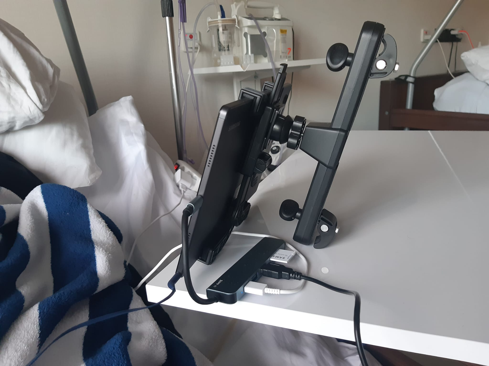
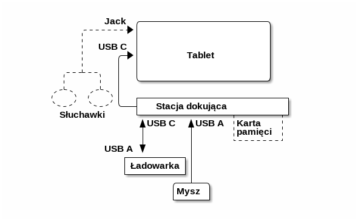

# Tablet z myszą typu trackball: Telefon i internet dla osoby z niepełnosprawnością ruchową

## Streszczenie

Ta strona powstała dla informacji dla osób z niepełnosprawnością ruchową i osób opiekujących się nimi, a także dla lekarzy i fizjoterapeutów.

Mój szwagier Andrzej [po złamaniu kręgosłupa może ruszać tylko głową i w ograniczonym stopniu prawą ręką](https://www.siepomaga.pl/andrzej-marcinek). Nie jest w tej chwili w stanie obsługiwać ekranu dotykowego ani laptopa.

Próbowałam dowiedzieć się z różnych źródeł w polskim i zagranicznym internecie, jakie rozwiązania techniczne są stosowane przez osoby z takim typem niepełnosprawności, żeby utrzymywać kontakt ze światem. Okazało się, że informacji jest niezwykle mało. 

Dlatego razem z moim bratem i mężem sami wymyśliliśmy najprostszy naszym zdaniem (i jednocześnie tani - poniżej 2000 zł) sposób na komunikację ze światem dla Andrzeja: Tablet z myszą typu trackball dla osób z niepełnosprawnością.

Dzięki temu pacjent ma możliwość telefonowania, wysyłania wiadomości tekstowych i dostęp do internetu Rozwiązanie ma tę wyższość nad laptopem, że pozwala łatwiej korzystać z telefonu, a także z usług internetowych przez różne aplikacje (filmy, podkasty, recepty i skierowania - patrz więcej w sekcji [Przydatne aplikacje](#przydatne-aplikacje)). Korzystanie z myszy bardzo wyraźnie przyśpieszyło postępy Andrzeja w rehabilitacji ręki. Dzięki tym postępom wkrótce był w stanie także nauczyć się sterować wózkiem z joystickiem.

Gdy Andrzej zaczął używać tabletu z myszą, zrobił tym furorę w swoim ośrodku rehabilitacyjnym i znalazł naśladowców. To właściwie dziwne, że w wyspecjalizowanym ośrodku nikt nie miał wiedzy o takich rozwiązaniach dla pacjentów.

Zrobiłam tę stronę dla informacji i podsunięcia pomysłu innym potrzebującym osobom oraz lekarzom, fizjoterapeutom i kierownikom ośrodków rehabilitacyjnych. Byłoby dobrze, gdyby różne ośrodki zdrowia wypożyczały taki sprzęt pacjentom.

[Poniżej](#spis-treści---szczegółowe-informacje-o-sprzęcie-i-jego-konfiguracji-znajdują-się-poniżej) podaję szczegółowe informacje techniczne na temat sprzętu i jego konfiguracji dla osoby z niepełnosprawnością ruchową.

Anna Ochab-Marcinek [anna.ochab.marcinek@gmail.com](mailto:anna.ochab.marcinek@gmail.com)

## Zdjęcia

### Zdjęcie 1. Ustawienie tabletu na stoliku i myszy na łóżku

Andrzej ma na uszach słuchawki (opcjonalna część zestawu). Obok Andrzeja, na łóżku, leży mysz BigTrack 2, do której sięga on ręką. Blat stolika przyłóżkowego sięga nad łóżko. Na stoliku stoi tablet oraz stacja dokująca.

### Zdjęcie 2. Sposób podpięcia do stacji dokującej myszy, tabletu, ładowarki i (opcjonalnie) karty pamięci

![Sposób podpięcia myszy, tabletu, ładowarki i (opcjonalnie) karty pamięci do stacji dokującej. Dodatkowo, do tabletu podpięte są (opcjonalnie) słuchawki. Na tym zdjęciu mysz połączona jest czarnym kablem USB-A ze stacją dokującą. Tablet połączony jest ze stacją dokującą czarnym kablem USB-C, który jest częścią stacji dokującej i który oprócz przesyłania danych pełni jednocześnie rolę kabla ładującego. Ładowarka jest połączona ze stacją dokującą białym kablem USB-C. Opcjonalnie, do stacji dokującej podpięta jest karta pamięci.](./IMG-20240131-WA0001.jpg)

 Na tym zdjęciu mysz połączona jest ze stacją dokującą czarnym kablem USB-A. Tablet połączony jest ze stacją dokującą czarnym kablem USB-C, który jest częścią stacji dokującej i który oprócz przesyłania danych pełni jednocześnie rolę kabla ładującego. Ładowarka jest połączona ze stacją dokującą białym kablem USB-C. Opcjonalnie, do stacji dokującej podpięta jest karta pamięci. Opcjonalnie, do tabletu podpięte są słuchawki.

### Zdjęcie 3. Widok uchwytu do tabletu

Jest to uchwyt oryginalnie przeznaczony do montowania na oparciu fotela samochodowego. Uchwyt został przekręcony o 90 stopni, tak, żeby opierał się o blat stolika. Nie jest to idealne rozwiązanie. Jakiś stojak na tablet byłby tutaj prawdopodobnie lepszy. Będziemy to poprawiać.

## Spis treści - szczegółowe informacje o sprzęcie i jego konfiguracji znajdują się poniżej

- [Tablet z myszą typu trackball: Telefon i internet dla osoby z niepełnosprawnością ruchową](#tablet-z-myszą-typu-trackball-telefon-i-internet-dla-osoby-z-niepełnosprawnością-ruchową)
  - [Streszczenie](#streszczenie)
  - [Zdjęcia](#zdjęcia)
    - [Zdjęcie 1. Ustawienie tabletu na stoliku i myszy na łóżku](#zdjęcie-1-ustawienie-tabletu-na-stoliku-i-myszy-na-łóżku)
    - [Zdjęcie 2. Sposób podpięcia do stacji dokującej myszy, tabletu, ładowarki i (opcjonalnie) karty pamięci](#zdjęcie-2-sposób-podpięcia-do-stacji-dokującej-myszy-tabletu-ładowarki-i-opcjonalnie-karty-pamięci)
    - [Zdjęcie 3. Widok uchwytu do tabletu](#zdjęcie-3-widok-uchwytu-do-tabletu)
  - [Spis treści - szczegółowe informacje o sprzęcie i jego konfiguracji znajdują się poniżej](#spis-treści---szczegółowe-informacje-o-sprzęcie-i-jego-konfiguracji-znajdują-się-poniżej)
  - [Wstęp](#wstęp)
    - [Na czym zależało nam przy wyborze rozwiązania technicznego](#na-czym-zależało-nam-przy-wyborze-rozwiązania-technicznego)
    - [Zastrzeżenie dotyczące linków do stron firm](#zastrzeżenie-dotyczące-linków-do-stron-firm)
    - [Aktualność informacji technicznych](#aktualność-informacji-technicznych)
  - [Stan pacjenta](#stan-pacjenta)
  - [Sprzęt](#sprzęt)
    - [Tablet](#tablet)
      - [Opis tabletu](#opis-tabletu)
    - [Mysz](#mysz)
      - [Przykładowe sklepy w Polsce oferujące mysz](#przykładowe-sklepy-w-polsce-oferujące-mysz)
      - [Opis myszy](#opis-myszy)
        - [Możliwości ruchowe](#możliwości-ruchowe)
        - [Ostrzeżenie: Opóźnienie prawego przycisku (Drag Lock)](#ostrzeżenie-opóźnienie-prawego-przycisku-drag-lock)
    - [Stacja dokująca](#stacja-dokująca)
      - [Opis stacji dokującej](#opis-stacji-dokującej)
    - [Uchwyt do tabletu](#uchwyt-do-tabletu)
    - [Stolik do tabletu](#stolik-do-tabletu)
    - [Opcjonalnie: Karta pamięci](#opcjonalnie-karta-pamięci)
    - [Opcjonalnie: Słuchawki](#opcjonalnie-słuchawki)
  - [Konfiguracja sprzętu](#konfiguracja-sprzętu)
    - [Połączenie tabletu, myszy, ładowarki i stacji dokującej](#połączenie-tabletu-myszy-ładowarki-i-stacji-dokującej)
    - [Konfiguracja tabletu](#konfiguracja-tabletu)
      - [Ułatwienia dostępu dla osoby z niepełnosprawnością](#ułatwienia-dostępu-dla-osoby-z-niepełnosprawnością)
        - [Powiększenie widoku](#powiększenie-widoku)
        - [Powiększenie czcionek](#powiększenie-czcionek)
        - [Zamiana funkcji prawego i lewego przycisku myszy](#zamiana-funkcji-prawego-i-lewego-przycisku-myszy)
      - [Przydatne aplikacje](#przydatne-aplikacje)
      - [Wyłączanie tabletu za pomocą myszy](#wyłączanie-tabletu-za-pomocą-myszy)
    - [Konfiguracja myszy](#konfiguracja-myszy)
      - [Nasza konfiguracja myszy](#nasza-konfiguracja-myszy)
      - [Filmy producenta myszy na YouTube](#filmy-producenta-myszy-na-youtube)
  - [Ewentualne inne modele sprzętu](#ewentualne-inne-modele-sprzętu)
    - [Ewentualne inne modele tabletu](#ewentualne-inne-modele-tabletu)
      - [Tablet musi mieć następujące funkcje](#tablet-musi-mieć-następujące-funkcje)
      - [Ostrożnie ze starymi modelami tabletów](#ostrożnie-ze-starymi-modelami-tabletów)
    - [Ewentualne inne modele myszy](#ewentualne-inne-modele-myszy)
    - [Ewentualne inne modele stacji dokującej](#ewentualne-inne-modele-stacji-dokującej)
  - [Ewentualne inne rozwiązania](#ewentualne-inne-rozwiązania)
    - [Dodatkowe przyciski do myszy](#dodatkowe-przyciski-do-myszy)
    - [Sterowanie głosowe](#sterowanie-głosowe)
    - [Laptop](#laptop)

## Wstęp

### Na czym zależało nam przy wyborze rozwiązania technicznego

- Pacjent ma mieć możliwość obsługiwania telefonu i SMS.
- Pacjent ma mieć dostęp do internetu.
- System na urządzeniu ma być znajomy dla pacjenta. W smartfonie, którego używał Andrzej przed wypadkiem, był system Android. Dlatego wybraliśmy tablet z systemem Android.
- Pacjent ma obsługiwać tablet samą myszą, ponieważ nie może obsługiwać ekranu dotykowego ani sterować urządzeniem za pomocą głosu.
- Pacjent ma obsługiwać mysz dłonią z niesprawnymi palcami. Dlatego wybraliśmy mysz z dużym trackballem (kulką do kręcenia).
- Urządzenia powinny wymagać jak najmniej obsługi ze strony osób postronnych (brak potrzeby wymiany baterii, unikanie podłączania i odłączania ładowarki).
- Możliwie najmniejsze zużycie energii przez urządzenia. Dlatego wybraliśmy mysz przewodową, bo mysz bezprzewodowa na Bluetooth powodowałaby szybsze rozładowywanie baterii w tablecie.

### Zastrzeżenie dotyczące linków do stron firm

Podajemy linki do stron producentów i przykładowych sklepów tylko dlatego, żeby ułatwić obejrzenie zdjęć i opisów sprzętu. Nie mamy związków z żadnym z tych producentów ani sklepów.

### Aktualność informacji technicznych

Informacje zawarte na tej stronie są aktualne na dzień 27.01.2024. Z czasem może pojawić się  sprzęt i oprogramowanie o innych możliwościach technicznych.

## Stan pacjenta

- [Po złamaniu kręgosłupa Andrzej może ruszać tylko głową i prawą ręką](https://www.siepomaga.pl/andrzej-marcinek).
  - Ruchomość prawej ręki jest ograniczona: Andrzej porusza przedramieniem i częściowo dłonią, ale nie może na razie chwytać.
  - Ma czucie w palcach.
  - Nie jest w tej chwili w stanie obsługiwać ekranu dotykowego.
- Na razie Andrzej miał pewne problemy z wyraźnym mówieniem z powodu rurki tracheotomijnej. Był w stanie mówić wyraźnie z zatkanym wylotem rurki, ale nie w każdej chwili miał na to siłę. Dlatego obecnie nie jest w stanie używać sterowania głosowego tabletem. Ostatnio Andrzejowi wyjęto rurkę, więc zobaczymy, co się zmieni.

## Sprzęt

### Tablet

[Samsung Galaxy Tab A8](https://www.samsung.com/pl/tablets/galaxy-tab-a/galaxy-tab-a8-lte-dark-gray-64gb-sm-x205nzaeeue/buy/)  (SM-X205 128 GB) z systemem Android 13

#### Opis tabletu

Tablet z gniazdem na kartę SIM i funkcją telefonu. Umożliwia telefonowanie, pisanie smsów, korzystanie z internetu (np. oglądanie YouTube, Netflixa).

(Uwaga! Nie każdy tablet z kartą SIM ma funkcję telefonu! Patrz rozdział [Ewentualne inne modele tabletu](#ewentualne-inne-modele-tabletu).)

### Mysz

[BIGtrack 2](https://www.ablenetinc.com/bigtrack-2/) (z gniazdami do przycisków) firmy Ablenet Inc.

#### Przykładowe sklepy w Polsce oferujące mysz

- [aac.netidea.pl](https://aac.netidea.pl/wlaczniki-i-interfejsy/62-big-track-z-gniazdami-do-przyciskow.html)
- [Arante](https://www.arante.pl/bigtrack-z-gniazdami-do-przyciskow.html)
- [Harpo](https://www.harpo.com.pl/sklep/sprzet-wspomagajacy-komunikacje/urzadzenia-zastepujace-mysz-komputerowa/big-track-2/)
- [Świat Programów](https://swiatprogramow.pl/bigtrack-2.html)

#### Opis myszy

##### Możliwości ruchowe

Mysz BIGtrack 2 ma duży trackball (kulkę do kręcenia) wielkości piłeczki tenisowej. Ma dwa dość duże przyciski. Mysz jest podłączona do tabletu przez kabel USB, nie potrzebuje własnych baterii.

Zależało nam na tym, żeby Andrzej mógł obsługiwać mysz dłonią z niesprawnymi palcami.

Andrzej chwali tę mysz, bo kręcenie trackballem jest dla niego także ćwiczeniem rehabilitacyjnym. Tak się składa, że na zajęciach rehabilitacyjnych Andrzej wykonuje ćwiczenia z piłką o podobnych rozmiarach. Tata Andrzeja mówi, że był "zszokowany", gdy zdał sobie sprawę, jak duży postęp zrobił Andrzej w ciągu miesiąca, odkąd dostał tablet i mysz.

Andrzej ma obecnie trudności z sięganiem do lewego przycisku myszy. Jest mu łatwiej przyciskać prawy przycisk. Z tego powodu zamieniliśmy funkcje prawego i lewego przycisku myszy (ustawia się to programowo na tablecie - patrz rozdział [Konfiguracja myszy](#konfiguracja-myszy)). W ten sposób przy obecnych ustawieniach dostosowanych do potrzeb Andrzeja prawy przycisk myszy spełnia funkcję lewego.

##### Ostrzeżenie: Opóźnienie prawego przycisku (Drag Lock)

Uwaga! Ten model myszy ma sprzętowo wbudowane opóźnienie prawego przycisku. Dotyczy ono tego przycisku, który fizycznie znajduje się po prawej stronie i nie zależy ono od programowych ustawień zamiany funkcji przycisków myszy.

(Opóźnienie prawego przycisku nazywa się [Drag Lock](https://ablenetinc.zendesk.com/hc/en-us/articles/360055125052-The-right-button-has-a-delayed-reaction-when-activated-on-the-BIGtrack). Jest ono przydatne np. na laptopie, gdy do niektórych funkcji użytkownik potrzebuje nacisnąć jednocześnie prawy i lewy przycisk myszy. Wtedy można najpierw wcisnąć prawy przycisk i puścić go, a on zachowuje się przez pewien czas tak, jakby był wciąż wciśnięty. Gdy przez ten czas nacisnąć lewy przycisk, ma to taki efekt, jakby oba były wciśnięte równocześnie.)

Jednak przez większość czasu do klikania używa się tego  przycisku myszy, który pełni funkcję lewego. Do obsługi tabletu Andrzej potrzebuje praktycznie wyłącznie tego jednego przycisku.

Z powodu ograniczeń ruchowych Andrzeja ustawiliśmy dla niego za pomocą ustawień programowych tabletu, żeby przycisk znajdujący się fizycznie po prawej stronie pełnił funkcję lewego.

Ale w tym modelu myszy przycisk znajdujący się fizycznie po prawej stronie działa z opóźnieniem około 2 sekund - jest to ustawienie sprzętowe i nie da się go zmienić za pomocą ustawień programowych z poziomu tabletu.

To powoduje, że trzeba dość długo czekać na na efekt kliknięcia. Może to być denerwujące. Jednak Andrzej woli to, niż normalną konfigurację przycisków i klikanie w lewy przycisk, gdyż jest on dla Andrzeja trudniej dostępny.

W innym modelu myszy, [Big Track Wireless](https://www.ablenetinc.com/content/html/Downloads/Computer_Access/bigtrack_wireless_quick_start_guide.pdf), jest przełącznik sprzętowy pozwalający wyłączyć opóźnienie prawego przycisku. Jednak ten model jest obecnie niedostępny w Polsce. Jednak przede wszystkim problemem jest, że ten model jest bezprzewodowy: Po pierwsze wymaga osobnej baterii, a po drugie obawiamy się, że Bluetooth powoduje szybsze rozładowywanie się baterii w tablecie (patrz rozdział [Ewentualne inne modele myszy](#ewentualne-inne-modele-myszy)).

### Stacja dokująca

[Tech Protect V4](https://www.mediaexpert.pl/komputery-i-tablety/akcesoria-komputerowe/stacje-dokujace-i-replikatory-portow/stacja-dokujaca-tech-protect-v4-hub-6w1-szary?gad_source=1&gclid=CjwKCAiAk9itBhASEiwA1my_62R1434M1coZELKKP6x4tg6E-hr3PBDWxvFb-6XLII4UWT76RfKvDhoCTLQQAvD_BwE)

#### Opis stacji dokującej

Stacja dokująca ma kilka gniazd USB i służy do tego, żeby tablet mógł jednocześnie mieć podpiętą mysz i ładowarkę na kablach USB. Tablet ma tylko jedno gniazdo USB (typu C, do małej zaokrąglonej wtyczki), więc musi przez to samo gniazdo być jednocześnie ładowany oraz obsługiwać mysz.

Dodatkowo, ta stacja dokująca ma gniazdo na kartę pamięci, na której można trzymać np. dane zgrane z innego urządzenia.

### Uchwyt do tabletu

[Zdjęcie 3](#zdjęcie-3-widok-uchwytu-do-tabletu) pokazuje widok uchwytu do tabletu. Chodziło nam o to, żeby postawić tablet na blacie pod odpowiednim kątem.

Jest to uchwyt oryginalnie przeznaczony do oparcia fotela samochodowego. Uchwyt został przekręcony o 90 stopni, tak, żeby opierał się o blat stolika.

Nie jest to idealne rozwiązanie. Jakiś stojak na tablet byłby tutaj prawdopodobnie lepszy. Będziemy to poprawiać.

### Stolik do tabletu

[Zdjęcie 1](#zdjęcie-1-ustawienie-tabletu-na-stoliku-i-myszy-na-łóżku) pokazuje ustawienie stolika przyłóżkowego, na którym postawiony jest tablet. Blat stolika sięga ponad łóżko.

Dobrze jest użyć takiego stolika przyłóżkowego, który można łatwo odsunąć, gdy pacjent potrzebuje czynności pielęgnacyjnych.

### Opcjonalnie: Karta pamięci

Ten element nie jest konieczny, ale Andrzej postanowił go użyć. Na karcie Andrzej ma zapisane jakieś dane, być może zgrane z innego urządzenia.

### Opcjonalnie: Słuchawki

Ten element nie jest konieczny, ale Andrzej postanowił go użyć. Słuchawki pomagają skupić się na oglądaniu filmów, jeśli w pokoju jest hałas.

## Konfiguracja sprzętu

### Połączenie tabletu, myszy, ładowarki i stacji dokującej

- USB A: Wtyczka USB duża
- USB C: Wtyczka USB mała zaokrąglona
- Jack: Wtyczka od słuchawek
- Linia przerywana: elementy opcjonalne

### Konfiguracja tabletu

#### Ułatwienia dostępu dla osoby z niepełnosprawnością

##### Powiększenie widoku

_Ta część strony zostanie wkrótce uzupełniona.............._

_Uwaga na znikające ikonki w Spotify przy dużym powiększeniu........._

##### Powiększenie czcionek

_Ta część strony zostanie wkrótce uzupełniona............................_

##### Zamiana funkcji prawego i lewego przycisku myszy

_Ta część strony zostanie wkrótce uzupełniona............................_

#### Przydatne aplikacje

- [Spotify](https://play.google.com/store/apps/details?id=com.spotify.music): Do słuchania muzyki i podkastów.
- [YouTube](https://play.google.com/store/search?q=youtube): Do oglądania filmów.
- [Netflix](https://play.google.com/store/search?q=netflix): Do oglądania fimów.
- [MojeIKP](https://play.google.com/store/search?q=MojeIKP): Wgląd do recept i skierowań.

#### Wyłączanie tabletu za pomocą myszy

Andrzej odkrył sposób wyłączania tabletu za pomocą myszy. Dzięki temu może to zrobić sam i nie musi prosić innych o pomoc.

_Ta część strony zostanie wkrótce uzupełniona............................_

### Konfiguracja myszy

#### Nasza konfiguracja myszy

Patrz rozdział [Zamiana funkcji prawego i lewego przycisku myszy](#zamiana-funkcji-prawego-i-lewego-przycisku-myszy).

#### Filmy producenta myszy na YouTube

Wyniki wyszukiwania "[BigTrack Ablenet](https://www.youtube.com/results?search_query=BigTrack+Ablenet)" na YouTube.

## Ewentualne inne modele sprzętu

### Ewentualne inne modele tabletu

#### Tablet musi mieć następujące funkcje

- Obsługę karty SIM, żeby łączyć się z internetem przez sieć komórkową.
- Funkcję telefonu, żeby dało się z niego dzwonić i pisać smsy. Uwaga! Nie każdy tablet z kartą SIM ma funkcję telefonu! Należy to sprawdzić przy kupowaniu.
- Funkcję [OTG](https://ekspert.ceneo.pl/otg), która umożliwia podłączenie myszy przez USB. Sposoby sprawdzenia, czy urządzenie ma finkcję OTG:
  - Sprawdzenie w dokumentacji technicznej tabletu.
  - Podłączenie jakiejkolwiek myszy USB do urządzenia. Jeśli mysz działa, to znaczy, że funkcja OTG działa.
  - Sprawdzenie za pomocą aplikacji na Androida. Przykładowa aplikacja: [USB OTG Checker](https://play.google.com/store/apps/details?id=com.treeteam.otgchecker&hl=pl&gl=US)

#### Ostrożnie ze starymi modelami tabletów

- Stare modele tabletów mogą mieć gniazdo USB-A lub micro-USB. Nie mamy wiedzy, czy da się wtedy podłączyć stację dokującą tak, żeby jeden kabel USB jednocześnie obsługiwał mysz i ładowanie tabletu.

### Ewentualne inne modele myszy
  
- Stary model [BIGtrack](http://www.sklep.altix.pl/pl/big-track-powi%C4%99kszona-mysz-komputerowa) (nie nasz) nie ma gniazd na dodatkowe przyciski. Nowy model BIGtrack 2 (nasz) ma gniazda na dodatkowe przyciski. Na stronach niektórych sklepów nie jest jasno napisane, który z tych dwóch modeli oferują.
- Z oferty używanych myszy BIGtrack wynika, że istnieją [stare modele na kablu ze złączem PS2](https://archiwum.allegro.pl/oferta/mysz-bigtrack-trackball-style-opd-i9580682669.html). Jest to przestarzały rodzaj złącza i nie nadaje się do tabletu! Tablety mają gniazdo USB.
- Model [BIGtrack bezprzewodowy](http://sklep.altix.pl/pl/big-track-bezprzewodowy) działa na Bluetooth. Jednak są z nim następujące niedogodności:
  - Model nie jest w tej chwili dostępny w Polsce. (Ale prawdopodobnie można kupić przez internet ze sklepów za granicą.)
  - Mysz bezprzewodowa wymaga baterii, które trzeba co jakiś czas wymieniać.

### Ewentualne inne modele stacji dokującej

Stacja dokująca musi mieć możliwość jednoczesnego ładowania tabletu i obsługiwania podłączonych urządzeń. To dlatego, że tablet ma tylko jedno gniazdo USB, więc musi przez to samo gniazdo być jednocześnie ładowany oraz obsługiwać mysz.

## Ewentualne inne rozwiązania

### Dodatkowe przyciski do myszy

Dodatkowe przyciski mogą być przydatną opcją dla pacjentów, którzy nie mogą sięgnąć do wbudowanych przycisków. Uwaga! W niektórych sklepach internetowych mysz BIGtrack 2 jest pokazana na zdjęciu z dwoma dodatkowo dopiętymi przyciskami. Należy zwrócić uwagę, że te dodatkowe przyciski nie są w komplecie z myszą! Są one sprzedawane oddzielnie! Przykładowe sklepy z dodatkowymi przyciskami:

- [Harpo](https://www.harpo.com.pl/zakupy/sprzet-wspomagajacy-komunikacje/przyciski-i-interfejsy/)
- [Altix](http://sklep.altix.pl/pl/przyciski-i-interfejsy)

### Sterowanie głosowe

W urządzeniach z Androidem jest opcja sterowania głosowego. (W przypadku Andrzeja nie używamy tej opcji, gdyż na razie ma on problemy z wyraźnym mówieniem z powodu rurki tracheotomijnej.)

### Laptop

Na pewno wartą rozważenia opcją na przyszłość jest użycie laptopa. Jednak w tej chwili tablet jest lepszy dla Andrzeja, bo jest prostszy w obsłudze i ma funkcję telefonu.

Z drugiej strony, istnieje wiele oprogramowania na laptopy przeznaczonego dla osób z niepełnosprawnościami. Istnieje także specjalistyczny sprzęt do sterowania laptopem (np. klawiatury, przełączniki). Będziemy przyglądać się tym możliwościom w przyszłości.
